# Nagar Rakshak Deployment Guide

This guide explains how to access the voice agent over the internet or local network without modifying the existing codebase or Docker configuration.

## ⚠️ Critical Architecture Note
The web interface (`realtime_multi.html`) automatically connects to WebSocket ports on the **same hostname** you access the website from.
- **Website Port**: `7777`
- **Konkani WebSocket**: `8765`
- **Multi-lingual WebSocket**: `8766`
- **English WebSocket**: `8767`
- **Hindi WebSocket**: `8768`

Because the application requires **direct access to multiple ports** (web + websockets), simple HTTP tunnels (like free Cloudflare Tunnels or Ngrok http) **will not work** out of the box because they typically only expose port 80/443.

---

## ✅ Recommended Method: Tailscale (Easiest & Most Secure)
Use a mesh VPN like Tailscale to access your machine securely from anywhere as if you were on the same Wi-Fi.

1. **Install Tailscale** on the host machine (where Docker is running).
   ```bash
   curl -fsSL https://tailscale.com/install.sh | sh
   sudo tailscale up
   ```
2. **Install Tailscale** on your client device (phone, laptop).
3. **Get the Tailscale IP** of your host machine (e.g., `100.x.y.z`).
4. **Access the App**: Open `http://100.x.y.z:7777/realtime_multi.html` in your browser.
   - The interface will load.
   - It will automatically try to connect to `ws://100.x.y.z:8765` (and others), which will work perfectly over the VPN.

---

## 🌐 Method 2: Public Port Forwarding (Standard Internet Access)
If you need public access without a VPN (e.g., for a demo to others), you must forward ports on your router.

1. **Find your Local IP**: Run `hostname -I` (e.g., `192.168.1.50`).
2. **Router Configuration**: Log in to your router and forward these TCP ports to your machine's local IP:
   - **7777** (Web UI)
   - **8765** (Konkani)
   - **8766** (Multi)
   - **8767** (English)
   - **8768** (Hindi)
3. **Find your Public IP**: Search "what is my ip" on Google.
4. **Access**: Open `http://<YOUR_PUBLIC_IP>:7777/realtime_multi.html`.

**Security Warning**: This exposes your development server to the entire internet. Ensure your firewall allows traffic on these ports.

---

## ❌ Why Ngrok / Cloudflare Tunnel (HTTP) won't work easily
If you try to tunnel just the web server (port 7777) to `https://myapp.ngrok-free.app`:
1. The website loads fine.
2. The JavaScript tries to connect to `wss://myapp.ngrok-free.app:8765`.
3. **Fails**: Ngrok/Cloudflare do not forward port 8765 on that public domain.

To use tunnels, you would need a paid plan supporting arbitrary TCP ports or run 5 separate tunnels (one for each port) AND modify the code to hardcode those separate domains, which violates the "no code change" requirement.

---

## 🏗️ System Architecture — Single-Port Exposure (Port 7777)

The diagram below shows the **target architecture** where only port **7777** is exposed to the internet. The backend server at that port handles all HTTP and WebSocket traffic, proxying internally to the language-specific pipelines.

### Access Points
| Method | Address |
|---|---|
| **Local** | `http://localhost:7777` |
| **LAN** | `http://122.15.2.30:7777` |
| **Domain** | `http://nagar-rakshak.tech:7777` |

### Architecture Diagram

```mermaid
graph TB
  subgraph INTERNET["☁️ Internet / Client"]
    USER["🖥️ User Browser<br/><i>realtime_multi.html</i>"]
  end

  subgraph FIREWALL["🔒 Firewall — Only Port 7777 Exposed"]
    direction TB

    subgraph BACKEND["🌐 Backend Server :7777"]
      HTTP["HTTP — Serves HTML/CSS/JS"]
      WSP["WebSocket Proxy<br/><i>Routes /ws/kok, /ws/en, /ws/hi</i>"]
    end
  end

  USER -- "HTTP :7777<br/>localhost / 122.15.2.30 /<br/>nagar-rakshak.tech" --> HTTP
  USER -- "WS :7777<br/>/ws/{language}" --> WSP

  subgraph DOCKER["🐳 Docker Bridge Network — konkani-network (Internal Only)"]
    direction TB

    subgraph PIPELINES["Voice Pipelines"]
      P_KOK["🗣️ Konkani Pipeline<br/>ws :8765<br/><i>ws_pipeline.py</i>"]
      P_EN["🗣️ English Pipeline<br/>ws :8767<br/><i>ws_pipeline_english.py</i>"]
      P_HI["🗣️ Hindi Pipeline<br/>ws :8768<br/><i>ws_pipeline_hindi.py</i>"]
    end

    subgraph STT_SERVICES["Speech-to-Text Services (GPU)"]
      STT_KOK["🎙️ Konkani STT<br/>:50051<br/><i>IndicConformer Large</i>"]
      STT_MULTI["🎙️ Multilingual STT<br/>:50052<br/><i>IndicConformer 600M</i>"]
    end

    subgraph LLM["LLM Service (GPU 1)"]
      OLLAMA["🧠 Ollama<br/>:11434<br/><i>Qwen3:4b</i>"]
    end

    subgraph TTS_EMBED["Text-to-Speech (In-Pipeline)"]
      TTS["🔊 HuggingFace TTS<br/><i>Embedded in each pipeline</i>"]
    end
  end

  WSP -- "ws :8765" --> P_KOK
  WSP -- "ws :8767" --> P_EN
  WSP -- "ws :8768" --> P_HI

  P_KOK -- "HTTP :50051" --> STT_KOK
  P_HI -- "HTTP :50052" --> STT_MULTI
  P_EN -- "HTTP :50052" --> STT_MULTI

  P_KOK -- "HTTP :11434" --> OLLAMA
  P_EN -- "HTTP :11434" --> OLLAMA
  P_HI -- "HTTP :11434" --> OLLAMA

  P_KOK -. "TTS" .-> TTS
  P_EN -. "TTS" .-> TTS
  P_HI -. "TTS" .-> TTS

  classDef internet fill:#1a1a2e,stroke:#667eea,color:#e0e0e0,stroke-width:2px
  classDef firewall fill:#2d1b3d,stroke:#f5576c,color:#fff,stroke-width:3px
  classDef backend fill:#16213e,stroke:#51cf66,color:#e0e0e0,stroke-width:2px
  classDef pipeline fill:#1e3a5f,stroke:#74c0fc,color:#e0e0e0,stroke-width:1px
  classDef stt fill:#2a1f3d,stroke:#b197fc,color:#e0e0e0,stroke-width:1px
  classDef llm fill:#3d2a1f,stroke:#ffd43b,color:#e0e0e0,stroke-width:1px
  classDef tts fill:#1f3d2a,stroke:#51cf66,color:#e0e0e0,stroke-width:1px

  class USER internet
  class HTTP,WSP backend
  class P_KOK,P_EN,P_HI pipeline
  class STT_KOK,STT_MULTI stt
  class OLLAMA llm
  class TTS tts
```



### Data Flow (Per User Request)

```mermaid
sequenceDiagram
    participant U as 🖥️ Browser
    participant B as 🌐 Backend :7777
    participant P as 🗣️ Pipeline
    participant S as 🎙️ STT Service
    participant L as 🧠 Ollama LLM
    participant T as 🔊 TTS

    U->>B: 1. GET / (Load HTML)
    B-->>U: realtime_multi.html

    U->>B: 2. WS connect /ws/en
    B->>P: Proxy to Pipeline :8767

    U->>B: 3. Audio stream (PCM16)
    B->>P: Forward audio
    P->>S: 4. STT request (HTTP)
    S-->>P: Transcribed text

    P->>L: 5. LLM query (HTTP)
    L-->>P: Response text

    P->>T: 6. TTS synthesis
    T-->>P: Audio chunks

    P-->>B: 7. Response (text + audio)
    B-->>U: Forward to client
```



### Key Design Decisions
- **Single port exposure** — Only `:7777` faces the internet; all other services are internal-only on the Docker bridge network
- **WebSocket proxying** — The backend at `:7777` reverse-proxies WebSocket connections to the correct pipeline based on the language path
- **No direct pipeline access** — Ports `8765`, `8766`, `8767`, `8768`, `50051`, `50052`, `11434` are **not** exposed outside the host
- **GPU allocation** — STT + Pipelines share GPU 0; Ollama LLM uses dedicated GPU 1
