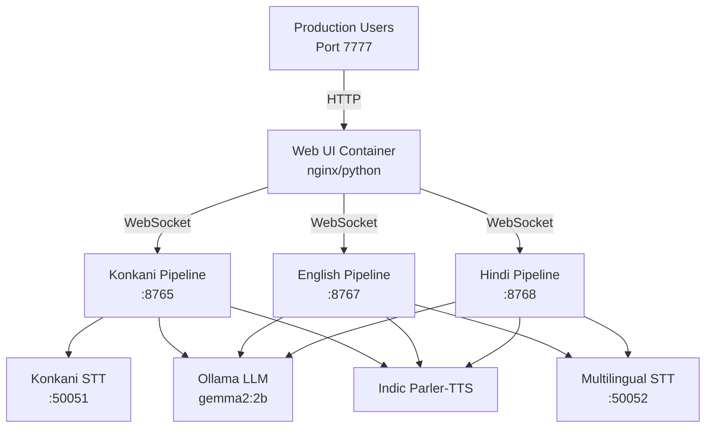

# Production Server on Port 7777

## Quick Start

The **Nagar Rakshak** system is now running in production mode on **port 7777**.

### Access the Application
```
http://localhost:7777/realtime_multi.html
```

---

## 🚀 Production Services

All services are running and ready:

| Service | Endpoint | Status |
|---------|----------|--------|
| **Web UI** | **http://localhost:7777** | ✅ **Running** |
| English Pipeline | ws://localhost:8767 | ✅ Running |
| Hindi Pipeline | ws://localhost:8768 | ✅ Running |
| Konkani Pipeline | ws://localhost:8765 | ✅ Running |
| Multilingual STT | http://localhost:50052 | ✅ Running |
| Konkani STT | http://localhost:50051 | ✅ Running |
| Ollama LLM | http://localhost:11435 | ✅ Running |

---

## 🎯 Language Selection

The web interface provides **three language tabs**:

1. **Konkani** → Connects to port 8765
2. **English** → Connects to port 8767 (TTS-friendly LLM)
3. **Hindi** → Connects to port 8768 (TTS-friendly LLM)

Each language has its own dedicated pipeline with optimized prompts.

---

## 🔧 Production Features

### ✅ TTS-Friendly LLM Prompts
- English and Hindi pipelines use **gemma2:2b** with special instructions
- LLM avoids apostrophes, contractions, and special symbols
- Cleaner, more natural text-to-speech output

### ✅ Dedicated Language Pipelines
- No language switching overhead
- Isolated conversation state per language
- Better debugging and monitoring

### ✅ Automatic Restart
- All containers configured with `restart: unless-stopped`
- System will auto-recover from crashes
- Production-grade reliability

---

## 📊 System Architecture



---

## 🛠️ Management Commands

### View Running Services
```bash
docker compose ps
```

### View Logs
```bash
# All services
docker compose logs -f

# Specific service
docker compose logs -f pipeline-english
docker compose logs -f pipeline-hindi
docker compose logs -f web-ui
```

### Restart Services
```bash
# Restart all
docker compose restart

# Restart specific service
docker compose restart pipeline-english
docker compose restart pipeline-hindi
```

### Stop Production Server
```bash
docker compose stop
```

### Start Production Server
```bash
docker compose start
```

---

## 📈 Monitoring

### Check Service Health
```bash
# Web UI
curl http://localhost:7777/realtime_multi.html

# English Pipeline
curl http://localhost:8767

# Hindi Pipeline
curl http://localhost:8768

# STT Service
curl http://localhost:50052/health

# Ollama LLM
curl http://localhost:11435/api/tags
```

### GPU Usage
```bash
nvidia-smi
```

---

## 🔒 Production Checklist

✅ Web UI accessible on port 7777  
✅ English pipeline running on 8767  
✅ Hindi pipeline running on 8768  
✅ All containers auto-restart enabled  
✅ TTS-friendly LLM prompts configured  
✅ GPU allocation optimized  
✅ Logging configured  

---

## 🐛 Troubleshooting

### Web UI not accessible
```bash
# Check if container is running
docker compose ps web-ui

# Restart web UI
docker compose restart web-ui
```

### Pipeline not connecting
```bash
# Check pipeline logs
docker compose logs pipeline-english
docker compose logs pipeline-hindi

# Restart pipeline
docker compose restart pipeline-english pipeline-hindi
```

### Audio issues
```bash
# Check browser console for WebSocket errors
# Ensure microphone permissions are granted
# Verify WebSocket connections in browser DevTools
```

---

## 📞 Support

**Production URL**: http://localhost:7777/realtime_multi.html
**Status**: ✅ **OPERATIONAL**
